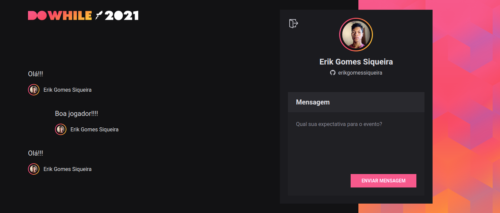

<h1 align="center"> 💻 NLW-Heat_React-JS ⚛ </h1>
 <p align="center">
    <i>Repositório aplicação desenvolvida no segundo dia</i>
</p>
<br>

## ℹ Sobre a aplicação
<!--Aqui vai uma decrição breve-->
<p>
  Está aplicação foi a segunda desenvolvida durante o evento NLW Heat, ultimo NLW do ano de 2021 feito pela <a href="https://www.rocketseat.com.br/">Rocketseat</a>. Ela foi desenvolvida usando React.js, Vite e a linguagem de programação TypeScript, além delas foram utilizados o Socket.IO para comunicação em tempo real, Scss para estilização e varias outras tecnologias. Essa aplicação é uma continuação da primeira por isso se ainda não não ela veja, ela será necessária(<a href="https://github.com/erikgomessiqueira/NLW-Heat_Node">Repositório NLW-Heat_Node</a>). Seu objetivo é:
</p>
<ul>
  <li>Obter o code para o login</li>
  <li>Logar com o GitHub</li>
  <li>Fornecer o Front-end para eviar e visualizar as mensagens</li>
  <li>Se integra ao Back-end e usar suas rotas para fazer as requisições e envios</li>
</ul>
<br>

## 🎴 Layout
 - ### 🖌 [Protótipo](https://www.figma.com/file/PoLst4irj2fmDAnwGcoC64/%5BNLW-Heat---Mission%3A-Impulse%5D-DoWhile2021-(Community)/duplicate)
<br>

<div>
  <p align="center">
    
    
  </p>
</div>
<br>

## ⚙ Dependências
  - Git
  - Node
  - Yarn
  - [NLW-Heat_Node](https://github.com/erikgomessiqueira/NLW-Heat_Node)
  

<br>

## 🛠 Ferramentas
  - [TypeScript](https://www.typescriptlang.org/)
  - [Vite](https://vitejs.dev/)
  - [Scss](https://sass-lang.com/)
  - [Socket.io-client](https://socket.io/docs/v4/client-api/)
  - [React-icons](https://react-icons.github.io/react-icons).

<br>

## ▶❔ Como executar
   ### Clone o repositório
  ```bash
    $ git clone https://github.com/erikgomessiqueira/NLW-Heat_React-JS.git
  ```
  <br/>
  
  ### Instale as Dependências
  
  Instale com yarn ou npm:
  ```bash
    yarn install
  ```
  <br/>
  
  ### Configurando o Client_id
  Agora precisamos estar com o servidor configurado, se ainda não fez a configuração faça acessando o [Repositório do NLW-Heat_Node](https://github.com/erikgomessiqueira/NLW-Heat_Node), se ja está configurado podemos seguir em frente. No arquivo [auth.tsx](https://github.com/erikgomessiqueira/NLW-Heat_React-JS/blob/master/src/contexts/auth.tsx)(_./src/contexts/auth.tsx_) temos que alterar o valor da constante chamada **client_id** que está na linha 36 do arquivo, ela deve receber o valor do **Client ID** da sua aplicação do  GitHub( ensinei como fazer isso no [NLW-Heat_Node](https://github.com/erikgomessiqueira/NLW-Heat_Node) já que a variavel de ambiente GITHUB_CLIENT_ID recebe o mesmo valor)
  
  Instale com yarn ou npm:
  ```javascript
    const client_id = 'Client ID da aplicação do GitHub'
  ```

<br>

### Configure a URL de retorno
   Para fazer essa configuração vá no GitHub em **Settings** => **Developer Settings** => **OAuth Apps**, acesse a aplicação que criamos no [NLW-Heat_Node](https://github.com/erikgomessiqueira/NLW-Heat_Node), procure por **Authorization callback URL** e mude para a URL que esta rodando o React.js(no caso desse projeto: http://localhost:3000/ )
  
<br/>

## ▶ Executando a aplicação

  ### Servidor
  Entre na pasta raiz do clone do [NLW-Heat_Node](https://github.com/erikgomessiqueira/NLW-Heat_Node) já configurado e execute o servidor(na sua documentação tambem ensina como executá-lo) usando o comando:
  ```bash
    yarn dev
  ```
  <br/>
  
  ### Web
  Entre na pasta raiz do clone da aplicação **NLW-Heat_React-JS** já configurada e execute o comando:
  ```bash
    yarn dev
  ```
  <br/>
  
  Deve retornar a URL de acesso:
  ```bash
    vite v2.6.10 dev server running at:

    > Local: http://localhost:3000/

  ```
<br/>
  
## 😁 Contrubuindo ao projeto

   > [Guia de como contribuir no GitHub](https://github.com/firstcontributions/first-contributions)
<br>

